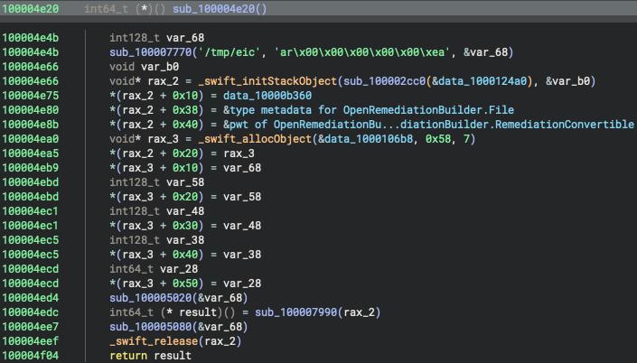
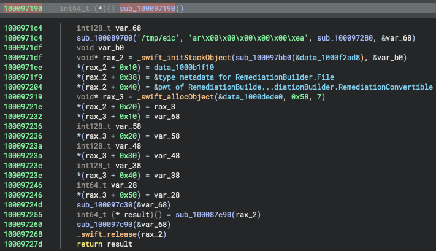

# OpenRemediationBuilder

A Swift reimplementation of the RemediationBuilder DSL presented at [Black Hat USA 2025](https://blackhat.com/us-25/briefings/schedule/#xunprotect-reverse-engineering-macos-xprotect-remediator-44791).

## Overview

OpenRemediationBuilder is a Swift reimplementation of the RemediationBuilder DSL used in XProtect Remediator. It was created during the reverse engineering process of RemediationBuilder to understand its specifications.

Currently, FileRemediationBuilder and some FileCondition implementations are available. Based on this implementation, we have created a minimal implementation to mimic XProtectRemediatorEicar to verify the DSL's behavior and validate the reverse engineering results by comparing them with disassembly results.

For specifications of the RemediationBuilder DSL, please refer to [RemediationBuilderDSLSpec](https://github.com/FFRI/RemediationBuilderDSLSpec).

## Usage

```
# Install dependencies
brew install yara
# Create test files
echo 'X5O!P%@AP[4\PZX54(P^)7CC)7}$EICAR-STANDARD-ANTIVIRUS-TEST-FILE!$H+H*' > /tmp/eicar
echo '012345678901234567890123' > /tmp/123456 
# To test the searchDepth parameter
mkdir -p /tmp/1/
echo '012345678901234567890123' > /tmp/1/123456 
# Build and run
swift run -c release
```

OpenRemediationBuilder does not remove files even when they match the conditions. So, after running the above commands, please remove the test files manually.

## Binary Ninja HLIL Comparison of OpenRemediationBuilder with Original XProtect Remediator

To verify XProtect Remediator uses the Swift result builder, we compared the HLIL generated by OpenRemediationBuilder and XProtect Remediator, specifically examining the HLIL of the DSL block that creates an array of `[any RemediationConvertible]` type. Note that OpenRemediationBuilder is built with Swift version 5.7.2.

**OpenRemediationBuilder**



**XProtect Remediator**



The results show that OpenRemediationBuilder reproduces the HLIL of the original XProtectRemediatorEicar, including local variables, stack layout, and Swift runtime API call patterns. This strongly supports the use of a Swift result builder in XProtect Remediator.

## License

This project is provided under the Apache License 2.0. See [LICENSE](LICENSE) for details.

## Author

Koh M. Nakagawa (@tsunek0h) © FFRI Security, Inc. 2025
